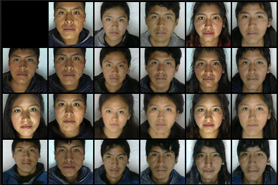
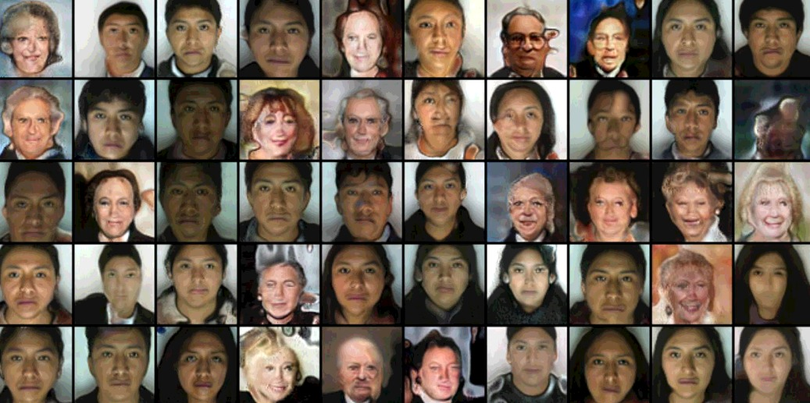
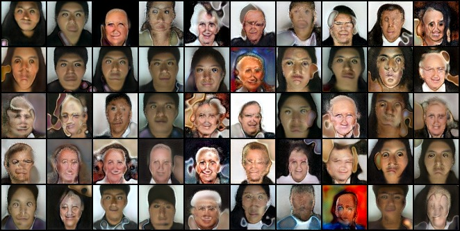

# Peruvian Style GAN

#### Dataset
Cada integrante del equipo clasificó 10.000 imágenes de celebridades. A continuación, se detalla reglas de anotación de personas mayores de edad (dataset de CelebA):

- Si se especula que tienen más de 55 años.
- Si las caras se encuentran mirando hacia la cámara (como la foto de DNI). Se consideró muy pocas fotos de perfil, donde se veía que la personas a pesar de estar en esa posición, miraba a la cámara.
- Si tienen rasgos de ancianos a pesar de su verdadera edad. Por ejemplo, existen celebridades (en su gran mayoría mujeres) que usan mucho maquillaje o cirugías para verse joven, estos casos no se tomaron en cuenta a pesar de que se sabía que eran personas mayores.
- A pesar de que exista deformidades en la foto. Por ejemplo, había casos donde la cabeza se estiraba hasta el extremo superior de la imagen.
- A pesar de que haya letras (pequeñas) sobre el rostro de la cara de la persona.
- A pesar de que use accesorios que tapaba gran parte de su rostro. Por ejemplo, un sombrero, en ocasiones su propio cabello.
- A pesar de que haya 2 rostros en la foto.
- Todas las caras que cumplan con las reglas antes descritas, sin filtrar algún rasgo o accesorio en particular.

El conjunto de datos Peruvian_Face, al tener una edad similar (entre 18 a 24 años) y fondo blanco sin accesorios y es homogéneo, al generar las imágenes (con el modelo entrenado) y comparar las características que aportan es poco notorio los cambios. Para mostrar las diferencias se creo un nuevo dataset con un aporte de 50% de rostros de peruanos y 50% de rostros de personas mayores de edad obtenidas de CelebA.

#### Conjunto de Datos Peruvian_face
- 5000 imagenes de peruanos jóvenes
- Fondo blanco
- Sin accesorios

#### Conjunto de datos old_celebA
- 2500 imagenes de personas mayores
- Rasgos caucasicos
- Fondo variado
- Con accesorios

#### Conjunto de datos peruvian_mix
- 5000 imagenes de personas jóvenes y mayores
- 50% peruvian face 
- 50% old_celeba

Al tener un conjunto de datos homogéneo  como peruvian face al momento de generar las imágenes y observar los aportes de dos imágenes en la obtención de una tercera imagen en el espacio latente, se podía apreciar los cambios. Para una mejor visualización se entrenó el conjunto de datos peruvian_mix , en el cual se tienen jóvenes peruanos y ancianos caucasicos.

El proceso de entrenamiento preliminar se realizó en Google Colab, para observar los resultados de acuerdo a los cambios que se realizó en el código replicados.

- Se redujo el número de iteraciones de 3.000.000 a 100.000, al trabajar con imágenes de 64x64 no se busca detalles muy exactos en las imágenes resultantes.
- Se modificó el *batch_size* para acelerar tiempos de entrenamiento.
- Se probó con diversos hiperparametros.

El entrenamiento final se realizó en Nvidia RTX 2080, el tiempo de entrenamiento fue de 20 horas.

Para tener una referencia en el proceso de entrenamiento se obtiene checkpoints con el modelo entrenado cada 10.000 iteraciones e imágenes de referencia cada 100 iteraciones.

#### Preprocesamiento de imágenes

Para iniciar el pro procesado de las imágenes se debe ejecutar en la terminal

*$python prepare.py “ruta de la carpeta con las imágenes” “Ruta destino”*

Las imágenes de los dos conjuntos de datos fueron pre procesados para uniformizar en tamaño, dimensión, obteniéndose un archivo de 2Gb el cual se utilizará al entrenar la red.

En el codigo **prepare_data.py** permite el redimensionamiento utilizando *Lanczos* a diferentes escalas, se optimiza para que redimensione a imágenes de 64px y guardarlas temporalmente en formato *jpeg*.

#### Modelo 
El modelo utiliza:
- Inicializador de pesos xavier inicialization
- Bloques convolucionales
- Progressive GAN
- AdaIN

#### Entrenamiento
El entrenamiento se realiza en un environment de conda con python 3.6, pytorch 1.3 y CUDA 10.01.

El modelo se encuentra adecuado para correr en múltiples GPUs, se modificó para que el entrenamiento se realice en un solo GPU.

Para inicar el entrenamiento en la terminal se ejecuta **train.py**, como se reduce el alcance a imágenes de 64px se debe ejecutar con los parámetros:

*$python train.py “Ruta archivo pre procesado” --init_size 64 --max_size 64*

Se utilizó un *batch_size* de 16 y un *learning rate* de 0.001 y 0.003

#### Ejemplos

## Sample
#### Peruvian Faces

#### Peruvian Mix

